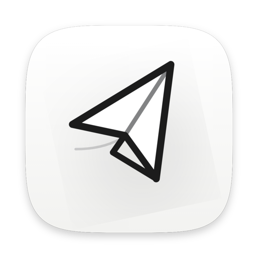
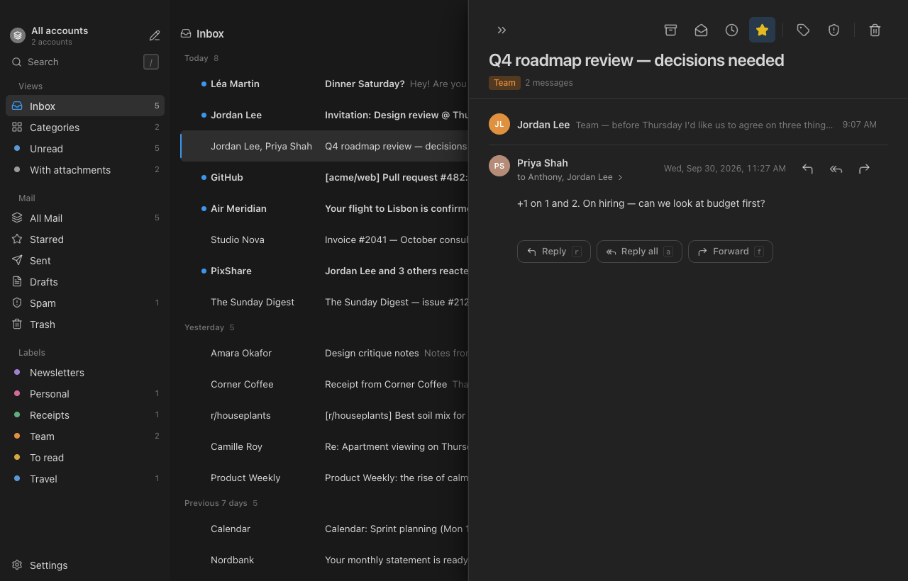

<div align="center">



# Naushen Mail

**A calm, keyboard-first desktop mail client for Gmail. No AI, no accounts, no servers.**

[](https://github.com/curiousanthony/naushen-mail/releases/latest)
[](https://github.com/curiousanthony/naushen-mail/releases)
[](https://github.com/curiousanthony/naushen-mail/actions/workflows/ci.yml)
[](LICENSE)


[](https://github.com/curiousanthony/naushen-mail/stargazers)
[](https://github.com/curiousanthony/naushen-mail/issues)
[](https://github.com/curiousanthony/naushen-mail/commits/main)
[](CONTRIBUTING.md)


[**Download**](#download) · [Features](#features) · [Privacy](#privacy) · [Build from source](docs/building.md) · [Contribute](CONTRIBUTING.md)




</div>

Naushen Mail brings the ergonomics of Notion Mail to your desktop: a block-style composer with a `/` menu, saved Views in
the sidebar, a side-peek reader, and a command palette on `Cmd/Ctrl+K`. It talks directly to your mail provider from
your own computer. There is no Naushen server, no telemetry and no AI. It is not affiliated with Notion.

> **Status: early (0.1.x).** Only **Gmail** is supported today. Outlook / Microsoft 365 support is implemented in the
> code but hidden until a Microsoft app registration exists, so it is **coming**, not available. A **Demo** account lets
> you try the whole UI offline.

## Download

Get the latest build from the [**Releases page**](https://github.com/curiousanthony/naushen-mail/releases/latest).

| Platform | Pick this file | Notes |
|---|---|---|
| macOS, Apple Silicon (M1 and later) | `Naushen-Mail-<version>-mac-arm64.dmg` | [First launch on macOS](docs/install.md#macos) |
| macOS, Intel | `Naushen-Mail-<version>-mac-x64.dmg` | Check `uname -m` if unsure |
| Windows 10/11 | `Naushen-Mail-<version>-<arch>-Setup.exe` | [First launch on Windows](docs/install.md#windows) |
| Linux | `.AppImage` or `.deb` | [Linux notes](docs/install.md#linux) |

File names include the version number, so use the [releases page](https://github.com/curiousanthony/naushen-mail/releases/latest)
to find the exact asset. Full instructions: [docs/install.md](docs/install.md).

**Unsigned builds.** Until the app is code-signed and notarised, your OS will warn you the first time:

- **macOS (Gatekeeper):** right-click the app in Applications, choose **Open**, then **Open** again. On recent macOS,
  if only "Done" is offered, go to **System Settings, Privacy & Security** and click **Open Anyway**. Or run
  `xattr -dr com.apple.quarantine "/Applications/Naushen Mail.app"`.
- **Windows (SmartScreen):** click **More info**, then **Run anyway**.

## Features

- **Views**: saved filters (with group and sort) in the sidebar, plus Mail folders and coloured labels.
- **Block composer**: `/` menu, markdown shortcuts, floating toolbar, attachments, signatures, snippets, drafts that autosave.
- **Send later and undo send**, plus reminders (snooze) and "follow up if no reply". These are local features.
- **Side-peek reader** (or centre peek / full page), quoted-text collapse, inline images, conversation view.
- **Keyboard-first**: Gmail-style single-key triage (`j k e # r a f s h l v …`), `g` sequences, multi-select, undo (`z`).
  See the [shortcut list](src/renderer/features/commands/shortcuts.ts) or press `?` in the app.
- **Command palette** on `Cmd/Ctrl+K`.
- **Rules** you can create from any thread, and unsubscribe from mailing lists.
- **Tracker shield**: remote images are blocked by default, and tracking pixels are listed rather than hidden.
- **Multiple accounts** with an all-accounts inbox, native notifications and a dock/taskbar badge.
- **Light, dark and system themes**, 9 languages.
- **Works from the local cache**: the UI reads a local SQLite database and acts optimistically.

Not included on purpose: AI features, Notion accounts or workspaces.

## Supported languages

English, French, Spanish, German, Portuguese (Brazil), Russian, Simplified Chinese, Japanese and Hindi.
Change it in Settings, or follow your system. Adding or fixing a translation is easy: see [docs/i18n.md](docs/i18n.md).

## Privacy

- There is **no Naushen server**. The app talks only to Google (and, later, Microsoft) from your device.
- **No telemetry, no analytics, no crash reporting.**
- Mail is cached **locally** in a SQLite database on your machine.
- Sign-in tokens are encrypted with your OS secure store (macOS Keychain, Windows DPAPI, Linux Secret Service via Electron `safeStorage`).
- Email HTML is sanitised and shown in a sandboxed frame with scripts disabled and remote images blocked until you allow them.

Details, including how to revoke access: [docs/PRIVACY.md](docs/PRIVACY.md).

## Why this license (and why it is not "open source")

Naushen Mail is released under the **[Functional Source License, Version 1.1, ALv2 Future License](LICENSE)**
(FSL-1.1-ALv2). This is a *Fair Source*, **source-available** license. It is **not** approved by the Open Source
Initiative, so calling this project "open source" would be inaccurate.

In plain terms:

- You may read, use, modify, self-host and redistribute it for any purpose **except a Competing Use**: offering it, or
  something substantially similar, to others as a commercial product or service.
- Internal use, personal use, education, research and consulting for licensees are all fine.
- **Each release converts to Apache-2.0 two years after it is published**, at which point it is fully open source.

It was chosen so that people can use, audit and contribute to the app freely while nobody can repackage it and sell it
as a competing product in the meantime. This summary is not legal advice; the [LICENSE](LICENSE) text is what applies.
Learn more at [fsl.software](https://fsl.software).

## Build from source

```bash
git clone https://github.com/curiousanthony/naushen-mail.git
cd naushen-mail
npm install
npm run dev
```

Needs Node.js 24. See [docs/building.md](docs/building.md) for packaging and [docs/google-setup.md](docs/google-setup.md)
if you want to use your own Google OAuth client. Try the **Demo** account (Settings, Add account, Demo) to explore offline.

## Contributing

Contributions are welcome. Read [CONTRIBUTING.md](CONTRIBUTING.md) and the [code of conduct](CODE_OF_CONDUCT.md). Report
security issues privately as described in [SECURITY.md](SECURITY.md). Changes are tracked in [CHANGELOG.md](CHANGELOG.md).

Project docs: [decisions](docs/00-decisions.md) · [design system](docs/03-design-system.md) ·
[email HTML contract](docs/05-email-html-contract.md) · [i18n](docs/i18n.md) · [maintainers](docs/maintainers.md)

## License

Copyright 2026 Anthony (curiousanthony). Licensed under [FSL-1.1-ALv2](LICENSE).
