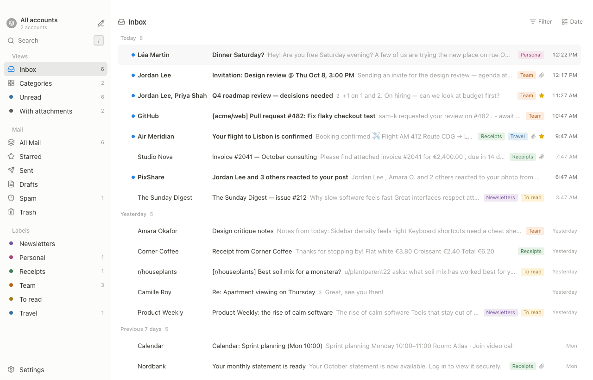

# Naushen Mail

A calm, keyboard-first desktop mail client for Gmail, on macOS, Windows and Linux. No AI, no accounts, no servers.

[Download the latest release](https://github.com/curiousanthony/naushen-mail/releases/latest) ·
[Source on GitHub](https://github.com/curiousanthony/naushen-mail) · [Privacy Policy](PRIVACY.md) · [Install guide](install.md)

- Keyboard-first triage, command palette, block composer with a `/` menu, saved Views.
- Gmail connects through a one-time personal Google setup (your own OAuth client, ~10 min): see the [setup guide](google-setup.md). Your mail goes only between your computer and Google. No telemetry, no Naushen server. See the [Privacy Policy](PRIVACY.md).
- 9 languages. Source-available under the [Functional Source License (FSL-1.1-ALv2)](https://github.com/curiousanthony/naushen-mail/blob/main/LICENSE), converting to Apache-2.0 after two years.

Naushen Mail is an independent project and is not affiliated with Notion.
